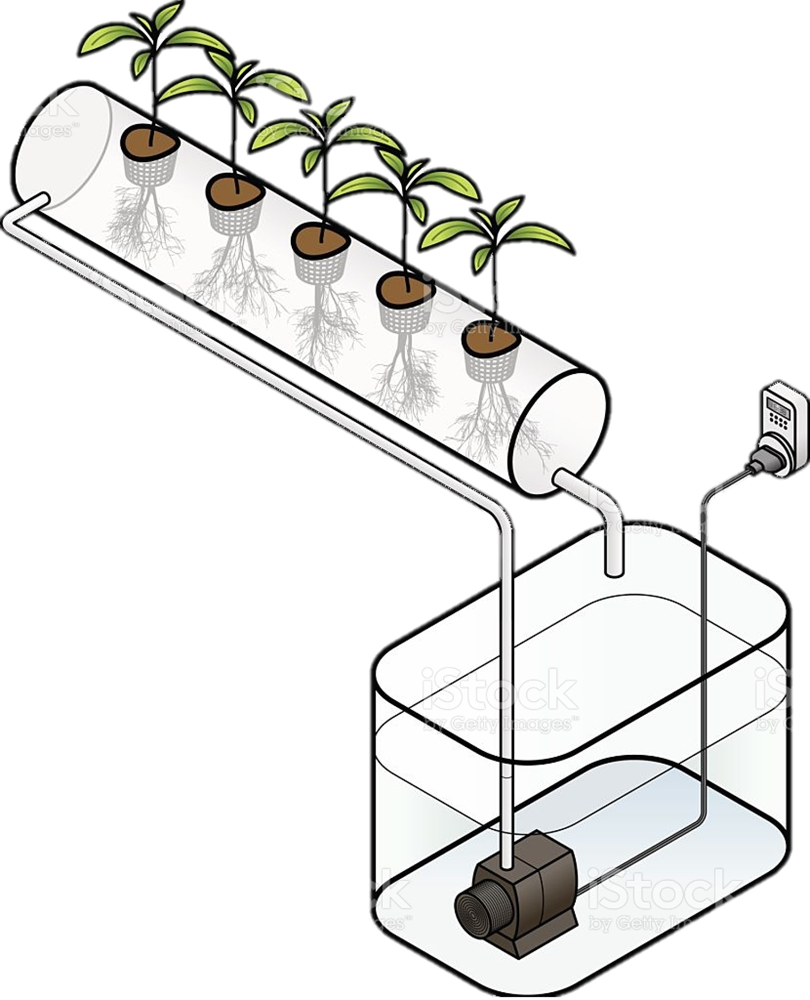

#

 

 

<h1>FarmLab

 

<h1>Electronica-ICT

<h2>Blueprint FarmLab

<h4>Onderdeel van project analyse

 

 

<h5>Nithujan Selvaratnam & Tarun Singh

<h5>Traject IT&IOT AP Hogeschool

 

<h5>Begeleider: Patrick Van Houtven <h5>Academiejaar 2021-2022 1ste semester

 
<a href="https://nithujansel.github.io/FarmLabAnalyse_Nithujan-Tarun/">GitHub Page</a> 

